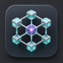
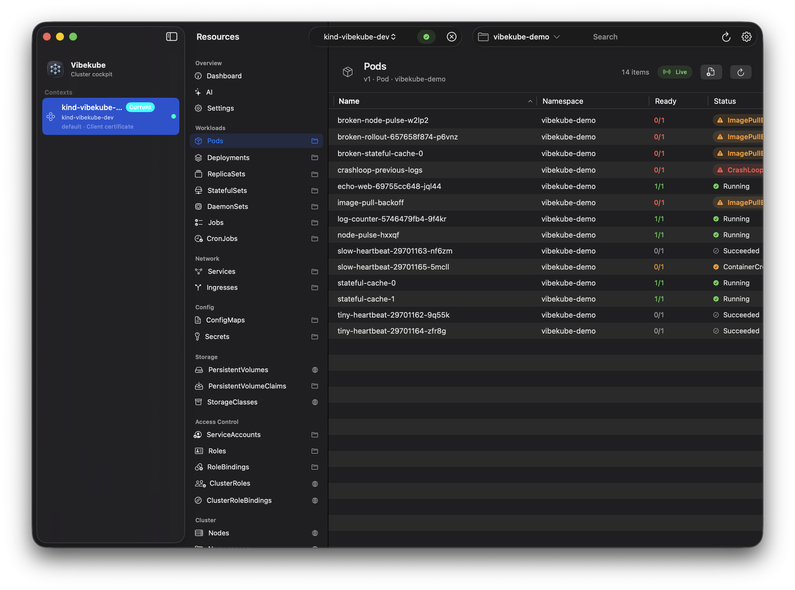
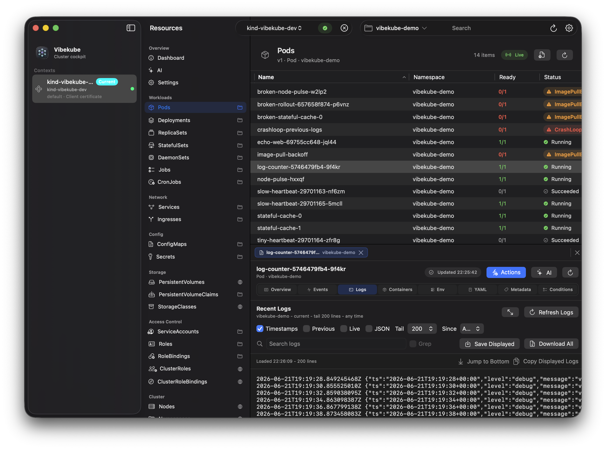
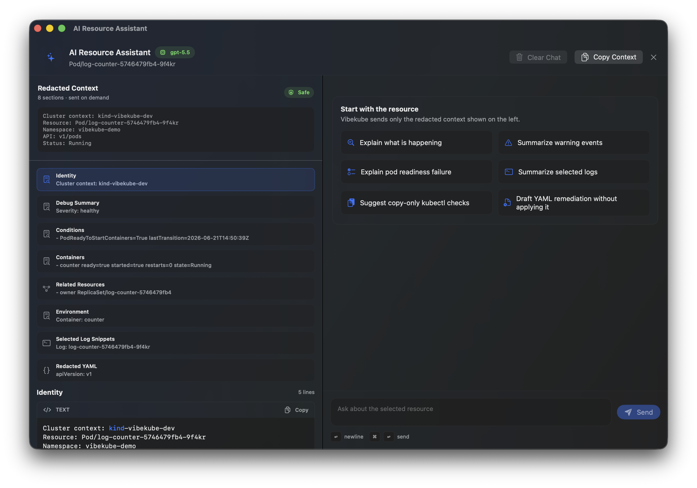

<p align="center">
  
</p>

<h1 align="center">Vibekube</h1>

<p align="center">
  A native macOS Kubernetes cockpit for fast cluster browsing, rich logs, safe operations, and optional cluster-aware AI.
</p>

<p align="center">
  <a href="https://github.com/rovnyart/vibekube/releases/latest"></a>
  <a href="https://vibekube.tech"></a>
  
  
  
  
</p>

<p align="center">
  <a href="https://vibekube.tech">Download</a>
  ·
  <a href="https://github.com/rovnyart/vibekube/releases">Releases</a>
  ·
  <a href="docs/PRIVACY.md">Privacy</a>
  ·
  <a href="docs/DEVELOPMENT.md">Development</a>
</p>

<p align="center">
  
</p>

Vibekube is built as a local-first desktop app: it reads your kubeconfig, connects directly to Kubernetes API servers, and does not send cluster data to a Vibekube backend. AI features are optional, user-initiated, and only contact the provider URL you configure.

## Download

Download the latest notarized macOS build from [vibekube.tech](https://vibekube.tech).

## Screenshots

<table>
  <tr>
    <td width="50%">
      
    </td>
    <td width="50%">
      
    </td>
  </tr>
  <tr>
    <td align="center"><strong>Live logs</strong><br>Search, filter, JSONL formatting, previous logs, fullscreen, copy, and export.</td>
    <td align="center"><strong>AI investigations</strong><br>Read-only cluster context, logs, Events, related Pods, Markdown answers, and visible redaction.</td>
  </tr>
</table>

## Highlights

- Native macOS interface with context sidebar, resource navigation, toolbar search, namespace selection, light/dark appearance, and density controls.
- Direct kubeconfig support for standard Kubernetes auth, client certificates, bearer tokens, and exec credential plugins such as Teleport `tsh`, `aws`, `gcloud`, and `kubelogin`.
- Fast browsing for common Kubernetes resources and CRDs, backed by real-time watches for active lists and selected resource details.
- Resource inspector with Overview, Events, Logs, Containers, Env, YAML, Metadata, Conditions, and dedicated Actions flows where they apply.
- Workload debug summaries that call out warning Events, scheduling context, replica gaps, container state, probes, volume mounts, restarts, termination details, and resource requests/limits.
- Practical debugging actions: `kubectl`-backed port-forwarding, external-terminal Pod exec, per-container exec choices, shell selection, and local launch history.
- Rich Pod logs: live streaming, timestamps, search, grep-style filtering, JSONL formatting, previous container logs, fullscreen mode, copy, save, and download-all.
- Related-resource navigation for owner references, workload/service selectors, Ingress backends, PVC/PV bindings, CronJob Jobs, and Pod ConfigMap/Secret references.
- Safe mutation workflows for scaling workloads, restarting rollouts, deleting resources, and applying YAML with dry-run preview, diff review, typed confirmations, RBAC/error surfacing, and local action history.
- Highlighted YAML editing with line numbers, search, server-side dry-run validation, expanded diff review, apply confirmation, and post-apply refresh.
- Optional AI assistant with OpenAI-compatible and Anthropic-compatible providers, custom URLs/headers, Keychain-stored secrets, model discovery, streaming chat, Markdown/code rendering, stop generation, and clear chat.
- AI resource investigations gather read-only cluster context on demand, including Events, conditions, redacted YAML, selected logs, selector-matched related Pods, Pod health, and bounded log/event snippets when useful.
- Strong Secret handling: Secret manifest payloads are redacted by default, Secret-backed env values are masked until explicitly revealed, diagnostics redact sensitive data, and mutation/AI history avoids leaking Secret values.
- Optional local diagnostics logging to `~/Library/Logs/Vibekube`, disabled by default.

## Requirements

- macOS 26.0 or later.
- A working Kubernetes kubeconfig, usually `~/.kube/config`.
- Any external kubeconfig exec plugins used by your contexts, for example `tsh`, `aws`, `gcloud`, or `kubelogin`.
- `kubectl` for external-terminal exec and port-forward helper actions.
- Optional: an API key for an OpenAI-compatible or Anthropic-compatible provider if you want AI features.

## Development

Requirements:

- Xcode 26.5 or newer.
- Docker, kind, and kubectl for the local demo cluster.

Build:

```sh
xcodebuild -project vibekube.xcodeproj -scheme vibekube -destination 'platform=macOS' build
```

Run the focused non-UI test suite:

```sh
xcodebuild -project vibekube.xcodeproj -scheme vibekube -destination 'platform=macOS' test -only-testing:vibekubeTests
```

Start the demo cluster:

```sh
dev/k8s/scripts/start.sh
```

More development notes live in [docs/DEVELOPMENT.md](docs/DEVELOPMENT.md), and the implementation roadmap lives in [docs/ROADMAP.md](docs/ROADMAP.md).

## Release Builds

Release packaging is handled by:

```sh
NOTARY_PROFILE=vibekube-notary scripts/release current
```

See [docs/RELEASE.md](docs/RELEASE.md) for signing, notarization, and DMG verification details.

## Privacy

Vibekube is local-first and has no Vibekube backend, telemetry, crash reporting, or automatic update checks. Optional AI calls are user-initiated and sent only to the provider URL configured in Settings with redacted resource context. See [docs/PRIVACY.md](docs/PRIVACY.md).
